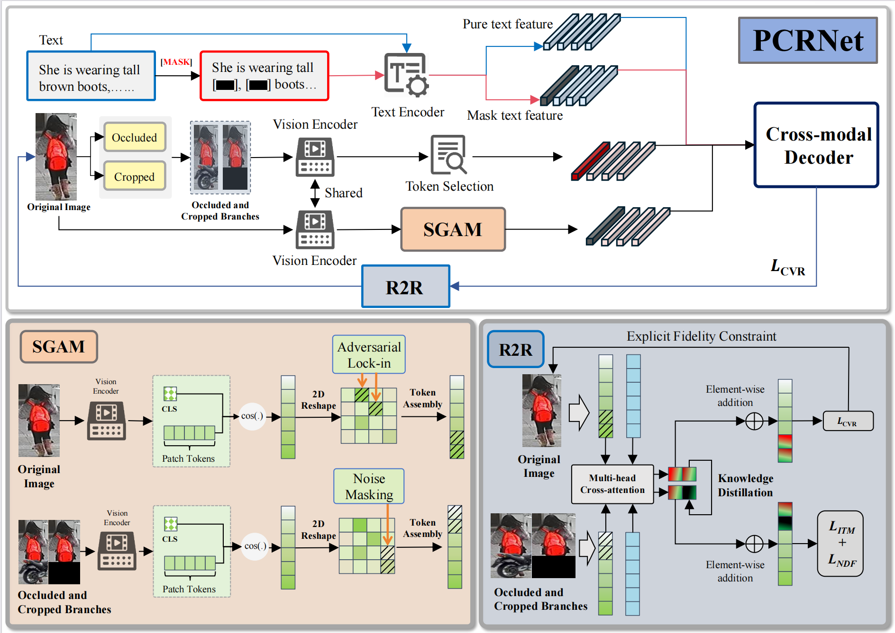

# PCRNet: Proactive Association Cross-modal Inference Reconstruction Network for Text-based Occluded Person Re-identification

## Introduction

PCRNet is a novel framework for **text-based occluded person re-identification (Re-ID)**. It integrates cross-modal inference and reconstruction to achieve robust matching between textual descriptions and occluded pedestrian images.

## Overview

## Environment

pip install -r requirements.txt

Any component in NLTK can be found [here](https://github.com/nltk/nltk_data/tree/gh-pages).

## Data preparation

Our data preparation follows the baseline paper:

> X. Wu, W. Ma, D. Guo, T. Zhou, S. Zhao, and Z. Cai, "Text-based Occluded Person Re-identification via Multi-Granularity Contrastive Consistency Learning," in *AAAI Conference on Artificial Intelligence*, vol. 38, pp. 6162–6170, 2024.

Please download the datasets and organize them according to the instructions in the baseline paper and organize the files as follows:

PCR-Net/
├── configs/
├── data/
├── models/
├── datasets/
│   ├── CUHK-PEDES/
│   ├── ICFG-PEDES/
│   └── RSTPReid/
└── nltk_data/

python process_data.py

## How to run

Download the pretrained BERT checkpoints from [here](https://huggingface.co/google-bert/bert-base-uncased) 
bash train.bash
